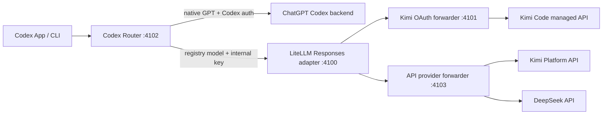

# Codex Router

Add external models to the normal Codex App model picker while preserving
native GPT models, ChatGPT sign-in, the selected default model, provider, and
profiles.

Codex Router is a local, OpenRouter-style routing layer built specifically for
Codex. Its provider registry currently includes Kimi and DeepSeek, and is
designed so future OpenAI-compatible providers and models are data additions
instead of new proxy implementations.

This is an independent community project. It is not affiliated with OpenAI,
Moonshot AI, DeepSeek, or OpenRouter.

## Models

| Picker label | Model ID | Authentication | Description |
| --- | --- | --- | --- |
| Kimi K3 (OAuth) | `kimi-oauth/k3` | Kimi Code CLI OAuth | Reuses an existing `kimi login` session. |
| Kimi K3 (API) | `kimi-api/kimi-k3` | Kimi Platform API key | Separately billed Kimi API access with maximum reasoning. |
| DeepSeek V4 Flash (API) | `deepseek/deepseek-v4-flash` | DeepSeek API key | Fast V4 reasoning, tool calls, and a 1M context window. |
| DeepSeek V4 Pro (API) | `deepseek/deepseek-v4-pro` | DeepSeek API key | V4 reasoning, coding, tool calls, and a 1M context window. |

The two V4 entries are every primary model currently returned by DeepSeek's
official `/models` API. The deprecated `deepseek-chat` and
`deepseek-reasoner` aliases remain routable from the CLI for compatibility but
are hidden from the picker because DeepSeek retires them on July 24, 2026.

## Install with Codex (easiest)

Give Codex this message and the repository link:

```text
Install this model router in my Codex App:
https://github.com/duolahypercho/codex-router

Follow the repository's AGENTS.md instructions, preserve my existing Codex
defaults and ChatGPT login, configure only the credentials I request, run the
doctor, and tell me when it is ready to restart. Do not quit Codex for me.
```

Codex clones the repository to a stable location, installs the background
router, and verifies every picker entry. If the requested authentication is
already configured, the user's only manual step is to fully quit Codex with
`Command-Q`, reopen it, and start a new task.

Never paste an OAuth token or API key into Codex chat. Codex should invoke the
hidden terminal prompt when a key is needed.

## Install from Terminal

Prerequisites: macOS, the Codex App, Node.js 22.19+, and `uv` or Python 3.10+.

```sh
curl -fsSL https://raw.githubusercontent.com/duolahypercho/codex-router/main/install.sh | sh
```

For an auditable install, clone the repository into a stable directory and run
`./install.sh`. The LaunchAgent stores the checkout's absolute path.

After installation, configure any credentials you want to use:

```sh
# Kimi Code OAuth
kimi login

# Kimi Platform API
"$HOME/.local/share/codex-router/bin/provider-key" kimi-api set

# DeepSeek API
"$HOME/.local/share/codex-router/bin/provider-key" deepseek set
```

Input from `provider-key ... set` is hidden and stored in a mode-`600` local
file. The running service reads credentials on every request, so setting or
rotating a key does not require a service restart.

Finally, fully quit Codex with `Command-Q`, reopen it, and start a new task.

## What the installer changes

The installer adds only this marked block to the root of
`~/.codex/config.toml`:

```toml
# BEGIN codex-router-managed
openai_base_url = "http://127.0.0.1:4102/v1"
model_catalog_json = "/absolute/path/to/.codex/codex-router/merged-models.json"
# END codex-router-managed
```

It does not set `model`, `model_provider`, `model_reasoning_effort`, profiles,
or ChatGPT authentication. A backup is created at
`~/.codex/config.toml.pre-codex-router` before the first change.

Codex supports `openai_base_url` for routing its built-in OpenAI provider and
`model_catalog_json` for a startup model-catalog override. Keeping the built-in
provider is what lets named external models coexist with native GPT models
instead of appearing as one generic `Custom` provider.

## How it works



Codex speaks the Responses API. The external providers currently expose
OpenAI-compatible Chat Completions APIs, so LiteLLM translates protocol events,
streaming output, tool calls, and compaction traffic. The dispatcher routes by
namespaced model ID.

Codex authentication headers are allow-listed only for the native route.
External routes receive a random internal service key; the final provider
forwarder discards that key and injects only the selected provider credential.
All listeners bind to `127.0.0.1`.

## Provider registry

[`config/providers.json`](config/providers.json) is the single source of truth
for providers and models. It drives:

- picker labels and descriptions;
- public and internal model IDs;
- context windows and reasoning levels;
- LiteLLM gateway generation;
- API base URLs and credential sources;
- request normalization and diagnostics.

An additional OpenAI-compatible Chat Completions provider normally requires a
provider object, one or more model objects, and tests. The shared API forwarder
handles authentication isolation and routing without adding another process or
port. Provider-specific request quirks can use a named request profile.

See [Development](docs/DEVELOPMENT.md) for the registry contract and extension
checklist. The router intentionally does not claim that every arbitrary model
will work without compatibility testing; Codex depends heavily on streaming,
tool calling, and long-running agent behavior.

## Commands

```sh
./bin/status                         # config, service, provider health
./bin/doctor                         # layered diagnostics
./bin/provider-key kimi-api status  # credential presence only
./bin/provider-key deepseek status  # never prints the key
./bin/refresh-catalog                # refresh after Codex/model changes
./bin/disable                        # stop routing, retain settings
./bin/enable                         # restore routing
./bin/uninstall                      # remove config/service, retain secrets
```

CLI model selection works after installation:

```sh
codex --model 'kimi-oauth/k3'
codex --model 'kimi-api/kimi-k3'
codex --model 'deepseek/deepseek-v4-flash'
codex --model 'deepseek/deepseek-v4-pro'
```

## Guides

- [Installation, authentication, and upgrades](docs/INSTALL.md)
- [Architecture and request flow](docs/HOW-IT-WORKS.md)
- [Security and credential handling](SECURITY.md)
- [Troubleshooting](docs/TROUBLESHOOTING.md)
- [Provider development and tests](docs/DEVELOPMENT.md)

## Current scope

- Automatic background-service installation currently targets macOS
  `launchd`.
- Responses WebSocket upgrades are declined; current Codex falls back to
  compressed HTTP.
- Kimi CLI OAuth storage is an implementation detail of Kimi Code and may need
  adaptation after a future CLI change.
- DeepSeek thinking mode is enabled for V4 models. Codex `high` maps to
  DeepSeek `high`; Codex `xhigh`, `max`, and `ultra` map to DeepSeek `max`.
- Codex documents Chat Completions provider support as deprecated. This project
  may need to adapt when Codex or an upstream provider changes protocols.

## References

- [DeepSeek models and pricing](https://api-docs.deepseek.com/quick_start/pricing)
- [DeepSeek model-list API](https://api-docs.deepseek.com/api/list-models)
- [DeepSeek thinking mode](https://api-docs.deepseek.com/guides/thinking_mode)
- [Kimi Code CLI setup and OAuth login](https://www.kimi.com/help/kimi-code/cli-getting-started)
- [Kimi K3 API quickstart](https://platform.kimi.com/docs/guide/kimi-k3-quickstart)
- [Codex advanced configuration](https://learn.chatgpt.com/docs/config-file/config-advanced)
- [opencodex](https://github.com/lidge-jun/opencodex)

MIT licensed. See [LICENSE](LICENSE) and [NOTICE.md](NOTICE.md).
