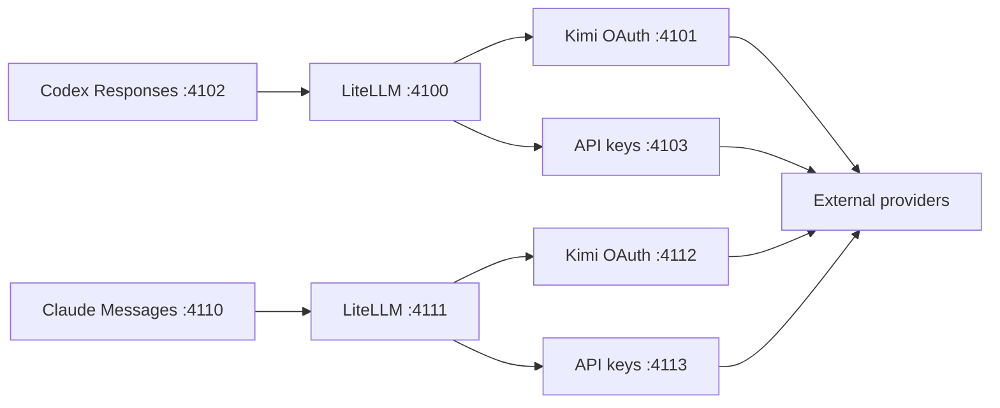

# Codex Router

Use Anthropic, Kimi, DeepSeek, xAI, and future external models inside supported
AI desktop apps through one local, credential-isolating router.

| Target | Integration | Status |
| --- | --- | --- |
| Codex App and CLI | Responses API plus native model-catalog merge | Stable |
| Claude Desktop | Third-party Anthropic Messages gateway | Experimental |
| Cursor | Manual OpenAI-compatible base URL | Experimental |

The targets share a provider registry and translation layer, but keep separate
ports, state, caller keys, provider selection, services, and app configuration.
Installing the Claude target does not edit Codex, and installing Codex does not
edit Claude.

Codex Router is an independent community project. It is not affiliated with or
endorsed by OpenAI, Anthropic, Moonshot AI, DeepSeek, OpenRouter, or the
referenced opencodex project.

## Give the link to your agent

For Codex, paste this into a Codex task:

```text
Install the Codex target from this public repository:
https://github.com/duolahypercho/codex-router

Follow AGENTS.md. Preserve my existing Codex models, profiles, settings, and
ChatGPT login. Use only the provider authentication I choose, safely migrate
only recognized older versions, run the Codex doctor, and leave the final app
restart to me. Never ask me to paste a token or API key into chat.
```

For Claude, paste this into Claude Desktop Code/Cowork or Claude Code:

```text
Install the experimental Claude Desktop target from this public repository:
https://github.com/duolahypercho/codex-router

Follow CLAUDE.md. Preserve my existing Claude configurations, Anthropic account
data, tools, plugins, MCP servers, and Codex setup. Use only the provider
authentication I choose, run the Claude doctor, and leave the final Claude
Desktop restart to me. Never ask me to paste a token or API key into chat.
```

If compatible authentication already exists, an agent can finish everything
except the final app restart. API keys are entered only through a hidden local
terminal prompt.

## Guided install

Codex on macOS or Linux:

```sh
curl -fsSL https://raw.githubusercontent.com/duolahypercho/codex-router/main/install.sh \
  | sh -s -- --target codex --guided
```

Claude Desktop on macOS:

```sh
curl -fsSL https://raw.githubusercontent.com/duolahypercho/codex-router/main/install.sh \
  | sh -s -- --target claude --guided
```

Windows PowerShell, changing `codex` to `claude` for the Claude target:

```powershell
$installer = Join-Path $env:TEMP "codex-router-install.ps1"
Invoke-WebRequest https://raw.githubusercontent.com/duolahypercho/codex-router/main/install.ps1 -OutFile $installer
powershell.exe -NoProfile -ExecutionPolicy Bypass -File $installer -Target codex -Guided
```

The setup selects providers, detects existing authentication, can run the
official `kimi login`, prompts invisibly for API keys, installs a per-user
background service, and verifies every local layer. It never makes a paid test
request unless `--smoke-test` is explicitly selected.

Requirements:

- The target app: Codex App/CLI, or the latest Claude Desktop on macOS/Windows.
- Node.js 22.19 or newer; Node.js 24 LTS is recommended.
- `uv`, or Python 3.10+ with `venv`.
- Git for the managed one-command checkout and rollback.

Linux installations support the Codex CLI. The Claude router can run on Linux
for development, but this project does not claim support for a Linux Claude
Desktop distribution.

## Models and authentication

| Picker label | Model ID | Authentication |
| --- | --- | --- |
| Kimi K3 (OAuth) | `kimi-oauth/k3` | Existing Kimi Code CLI OAuth session |
| Kimi K3 (API) | `kimi-api/kimi-k3` | Separately billed Kimi Platform API key |
| DeepSeek V4 Flash (API) | `deepseek/deepseek-v4-flash` | DeepSeek API key |
| DeepSeek V4 Pro (API) | `deepseek/deepseek-v4-pro` | DeepSeek API key |
| Grok 4.5 (OAuth) | `grok-oauth/grok-4.5` | Official Grok CLI OAuth session |
| Grok 4.5 (API) | `grok-api/grok-4.5` | Separately billed xAI API key |
| Claude Opus 4.8 (API) | `anthropic-api/claude-opus-4.8` | Separately billed Anthropic API key |

Grok OAuth reuses the official CLI credential at `~/.grok/auth.json` and sends
it only to xAI's documented Grok CLI inference proxy. On that path the router
also attaches hosted `web_search` and `x_search` tools so xAI can run realtime
web/X search server-side within the account's included Grok CLI quota. Set
`GROK_OAUTH_HOSTED_SEARCH=0` to disable those tools. Install the official CLI
and authenticate before enabling the route:

```sh
npm install -g @xai-official/grok
grok login --oauth
```

Native GPT models continue to use Codex directly. There is no separate GPT or
ChatGPT OAuth provider in the router.

Kimi Code OAuth and Kimi Platform API access are separate authentication and
billing systems. The two Kimi entries intentionally coexist. Older DeepSeek
aliases remain hidden compatibility routes and are not advertised to new users.

Only enabled providers appear in an app's picker. Each target has its own
selection and API-key files:

```sh
./bin/model-router codex providers
./bin/model-router claude providers
./bin/model-router claude providers enable deepseek
./bin/model-router claude provider-key deepseek set
./bin/model-router codex provider-key anthropic-api set
```

On Windows, use `./model-router.ps1` with the same target and command.

The API-key prompt disables terminal echo. Protected files use mode `600` on
POSIX and an inheritance-disabled, current-user ACL on Windows. Diagnostics
report credential presence and source, never the value.

## Make models appear in Codex

After setup:

1. Run `./bin/model-router codex doctor` and resolve any `FAIL` line.
2. Confirm `providers` says `SHOW` and `ready` for the intended provider.
3. Fully quit Codex, reopen it, and create a new task.
4. Open the normal model picker.

Codex loads `model_catalog_json` only at app startup. If models are still
missing, run `./bin/refresh-catalog`, fully quit Codex, and reopen it.

The integration preserves the built-in OpenAI provider, native GPT models,
ChatGPT sign-in, profiles, MCP settings, project trust, and reasoning defaults.
It adds only one marked root block to the user's Codex config:

```toml
# BEGIN codex-router-managed
openai_base_url = "http://127.0.0.1:4102/_codex-router/<generated-capability>/v1"
model_catalog_json = "/absolute/path/to/.codex/codex-router/merged-models.json"
# END codex-router-managed
```

The generated path is local caller authentication. Do not paste the complete
managed URL into an issue.

## Make models appear in Claude Desktop

The Claude target uses Claude Desktop's third-party inference gateway mode. Run:

```sh
./bin/model-router claude doctor
```

Then fully quit and reopen Claude Desktop and choose the local third-party
deployment when prompted. The installer creates one owned entry in the current
user's `Claude-3p/configLibrary`, preserves all other entries, and restores the
previous selection when disabled.

Anthropic documents gateway mode for Claude models. Kimi and DeepSeek through
that interface are an experimental community compatibility path, not an
Anthropic-supported model configuration. Standard Claude data and Anthropic
sign-in are not replaced, but third-party mode uses provider authentication and
billing rather than a Claude subscription.

The automated config-library integration is also experimental because its
on-disk layout is not a documented public API. The supported manual fallback is
Claude Desktop's **Developer → Configure Third-Party Inference…** window. See
[the Claude target guide](docs/CLAUDE.md) for exact fields, rollback behavior,
tool support, and troubleshooting.

## macOS tray control panel

On macOS, build and open the native menu-bar control panel with:

```sh
./bin/model-router-tray
```

It shows Codex health, detailed usage for the active provider, a seven-day
overview of every configured or previously used provider, and auto-applied
provider controls in a native glass macOS interface. See the
[macOS tray guide](docs/MACOS-TRAY.md) for behavior and rebuild notes.

The app also places a Dynamic-Island-style overlay at the top center of the
active display. It follows the provider handling the latest request, reveals
usage on hover, and expands on click. The menu-bar panel remains available for
the all-provider overview and configuration.

## Windows and Linux tray control panel

Windows and Linux use the shared Tauri tray companion in `apps/desktop`. It
provides the same connected-provider filtering, normalized quota cards, daily
token graph, secure provider setup, and animated activity status as the macOS
surface.

```sh
# Linux
./bin/model-router-tray
```

```powershell
# Windows PowerShell
.\scripts\build-desktop-tray.ps1 -BinaryOnly
Start-Process .\apps\desktop\src-tauri\target\release\codex-router-desktop.exe
```

Windows and Linux on X11 receive the floating top-center activity pill. Linux
on Wayland uses the tray panel without the pill because the compositor owns
absolute window placement. See the
[Windows and Linux tray guide](docs/DESKTOP-TRAY.md) for prerequisites,
packaging, and the platform behavior matrix.

## Common commands

```sh
./bin/model-router codex setup --guided
./bin/model-router claude setup --guided
./bin/model-router claude status
./bin/model-router claude doctor --fix
./bin/model-router claude disable
./bin/model-router claude enable
./bin/model-router claude uninstall
./bin/model-router cursor setup --guided
./bin/model-router cursor doctor
```

The optional live check makes one small request per selected provider and may
consume paid quota:

```sh
./bin/model-router claude smoke-test --yes
```

`disable` removes only the selected app integration and its current service.
`uninstall` intentionally retains the checkout, logs, backups, internal keys,
and provider credentials so routine removal cannot destroy authentication or
recovery data.

## Updates and rollback

For a managed Git checkout:

```sh
./bin/model-router codex update
./bin/model-router claude update
./bin/model-router claude rollback
```

Updates require a clean `main` checkout and a recognized repository origin.
The previous revision is retained as a local rollback ref, and a failed install
restores the previous source revision. If both targets are installed, run each
target's `doctor --fix` after an update or rollback so both generated configs
and services match the shared source revision.

Tagged releases contain `.tar.gz` and `.zip` source archives, SHA-256 checksums,
and GitHub build-provenance attestations.

## How routing works



Codex sends the Responses API; Claude sends the Anthropic Messages API.
LiteLLM translates either contract to each provider's native protocol,
including OpenAI-compatible Chat Completions and Anthropic Messages, with
streaming and tool-call shapes preserved. Every listener binds to `127.0.0.1`.

Both frontends authenticate the caller before reading model traffic. They pass
only a different random internal key to LiteLLM. The final forwarder discards
that key and injects only the selected provider credential. Browser-originated
requests are rejected, secrets are never exposed by public health routes, and
network-facing errors are sanitized.

The host app still owns the agent loop, tools, permissions, files, plugins,
skills, MCP servers, and conversation state. The router handles model inference
and protocol translation; it cannot add a capability the selected model or
provider does not implement.

## Add future providers and models

[`config/providers.json`](config/providers.json) is the validated registry for
provider metadata, picker entries, upstream IDs, API protocols, context limits, request
profiles, modalities, and credential sources. Tested OpenAI-compatible and
Anthropic API providers share one credential-isolating forwarder and become
available to every implemented app target after compatibility tests pass.

Discovery does not publish every upstream model blindly:

```sh
./bin/discover-models deepseek
./bin/test-model 'deepseek/deepseek-v4-pro' --live --yes
```

New models should remain unlisted until official capabilities and live text,
streaming, image-input, tool-call, and context behavior are verified for each
target. See [Development](docs/DEVELOPMENT.md) for the registry contract.

## Documentation

- [Installation, migration, and upgrades](docs/INSTALL.md)
- [Claude Desktop target](docs/CLAUDE.md)
- [Cursor target](docs/CURSOR.md)
- [Compatible apps: T3 Code and opencode](docs/COMPATIBLE-APPS.md)
- [Troubleshooting](docs/TROUBLESHOOTING.md)
- [Architecture and request flow](docs/HOW-IT-WORKS.md)
- [Security and credential handling](SECURITY.md)
- [Provider development and tests](docs/DEVELOPMENT.md)
- [Changelog](CHANGELOG.md)

References: [Kimi Code CLI OAuth](https://www.kimi.com/help/kimi-code/cli-getting-started),
[Kimi K3 API](https://platform.kimi.com/docs/guide/kimi-k3-quickstart),
[DeepSeek model API](https://api-docs.deepseek.com/api/list-models),
[Anthropic models](https://platform.claude.com/docs/en/about-claude/models/overview),
[Anthropic Messages API](https://platform.claude.com/docs/en/api/messages),
[Codex advanced configuration](https://learn.chatgpt.com/docs/config-file/config-advanced),
[Claude Desktop third-party gateway](https://claude.com/docs/third-party/claude-desktop/gateway),
and [opencodex](https://github.com/lidge-jun/opencodex).

MIT licensed. See [LICENSE](LICENSE) and [NOTICE.md](NOTICE.md).
