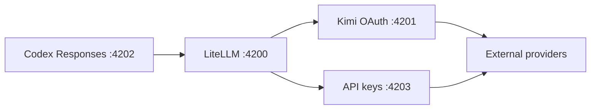

# Codex Router

Use Anthropic, Kimi, DeepSeek, xAI, GitHub Copilot, opencode Go, Command Code,
and future external models inside the Codex App and CLI — or inside
[DeepSeek Harness](https://github.com/deepseek-ai/deepseek-harness) — through
one local, credential-isolating router.
The integration speaks the Responses API and merges external entries into
Codex's native model catalog, so routed models appear in the normal picker
next to the native GPT models. The same routed models publish into the
harness as one provider route, so they appear in its Models page too.

Both clients share one installation: one background service, one gateway, one
set of provider credentials, one provider selection. Installing the second
integration does not ask for a single key again.

Codex Router is an independent community project. It is not affiliated with or
endorsed by OpenAI, GitHub, Anthropic, Moonshot AI, DeepSeek, OpenRouter,
opencode, or the referenced opencodex project.

## Give the link to your agent

Paste this into a Codex task:

```text
Install the router from this public repository:
https://github.com/duolahypercho/codex-router

Follow AGENTS.md. Preserve my existing Codex models, profiles, settings, and
ChatGPT login. Use only the provider authentication I choose, safely migrate
only recognized older versions, run the Codex doctor, and leave the final app
restart to me. Never ask me to paste a token or API key into chat.
```

If compatible authentication already exists, an agent can finish everything
except the final app restart. Provider credentials are entered only through a
hidden local terminal prompt.

## Install

### Homebrew

If you already use Homebrew, install Codex Router from this repository's tap:

```sh
brew tap duolahypercho/codex-router https://github.com/duolahypercho/codex-router
brew install codex-router
codex-router setup --guided
```

The tap URL is needed only once. Homebrew installs the formula's Node.js,
Python, and build dependencies; `codex-router setup --guided` performs the
one-time provider selection, credential-safe authentication, background
service installation, and Codex integration. When setup finishes, fully quit
and reopen Codex, create a new task, and choose a routed model from the picker.

Upgrade an existing Homebrew installation with:

```sh
brew upgrade codex-router
```

Before removing the formula, remove the per-user service and managed Codex
configuration that Homebrew does not own:

```sh
codex-router uninstall
brew uninstall codex-router
```

The first Homebrew install can take considerably longer than the guided
installer below because the formula builds the locked Python dependencies from
source. The release workflow generates `Formula/codex-router.rb` from
`requirements/python.txt` and refreshes it for each release.

Maintainers preparing the eventual `homebrew/core` submission should follow
[`docs/HOMEBREW_CORE.md`](docs/HOMEBREW_CORE.md).

### Guided installer

macOS or Linux:

```sh
curl -fsSL https://raw.githubusercontent.com/duolahypercho/codex-router/main/install.sh \
  | sh -s -- --target codex --guided
```

Windows PowerShell:

```powershell
$installer = Join-Path $env:TEMP "codex-router-install.ps1"
Invoke-WebRequest https://raw.githubusercontent.com/duolahypercho/codex-router/main/install.ps1 -OutFile $installer
powershell.exe -NoProfile -ExecutionPolicy Bypass -File $installer -Target codex -Guided
```

The setup selects providers, detects existing authentication, can run the
official `kimi login`, prompts invisibly for provider credentials, installs a per-user
background service, and verifies every local layer. It never makes a paid test
request unless `--smoke-test` is explicitly selected.

Requirements:

- The Codex App or CLI.
- Node.js 22.19 or newer; Node.js 24 LTS is recommended.
- `uv`, or Python 3.10+ with `venv`.
- Git for the managed one-command checkout and rollback.

Linux installations support the Codex CLI.

## Models and authentication

| Picker label | Model ID | Authentication |
| --- | --- | --- |
| K2.7 Coding Highspeed (OAuth) | `kimi-oauth/kimi-for-coding-highspeed` | Existing Kimi Code CLI OAuth session |
| K2.7 Coding (OAuth) | `kimi-oauth/kimi-for-coding` | Existing Kimi Code CLI OAuth session |
| Kimi K3 (OAuth) | `kimi-oauth/k3` | Existing Kimi Code CLI OAuth session |
| Kimi K3 (API) | `kimi-api/kimi-k3` | Separately billed Kimi Platform API key |
| Kimi K3 (China API) | `kimi-api-cn/kimi-k3` | Separately billed Moonshot **China** platform key |
| DeepSeek V4 Flash (API) | `deepseek/deepseek-v4-flash` | DeepSeek API key |
| DeepSeek V4 Pro (API) | `deepseek/deepseek-v4-pro` | DeepSeek API key |
| Grok 4.5 (OAuth) | `grok-oauth/grok-4.5` | Official Grok CLI OAuth session |
| Grok 4.5 (API) | `grok-api/grok-4.5` | Separately billed xAI API key |
| Claude Opus 4.8 (API) | `anthropic-api/claude-opus-4.8` | Separately billed Anthropic API key |
| GLM-5.2 (Ollama Cloud) | `ollama-cloud/glm-5.2` | Ollama Cloud API key |
| Kimi K2.7 Code (Ollama Cloud) | `ollama-cloud/kimi-k2.7-code` | Ollama Cloud API key |
| MiniMax M3 (Ollama Cloud) | `ollama-cloud/minimax-m3` | Ollama Cloud API key |
| DeepSeek V4 Pro (Ollama Cloud) | `ollama-cloud/deepseek-v4-pro` | Ollama Cloud API key |
| DeepSeek V4 Flash (Ollama Cloud) | `ollama-cloud/deepseek-v4-flash` | Ollama Cloud API key |
| MiniMax M3 | `minimax-token-plan/minimax-m3` | MiniMax Token Plan API key |
| Qwen3.8 Max (Plan) | `qwen-plan/qwen3.8-max` | Alibaba Model Studio plan API key |
| Qwen3.8 Max Preview (Plan) | `qwen-plan/qwen3.8-max-preview` | Alibaba Model Studio plan API key |
| Qwen3.7 Max (Plan) | `qwen-plan/qwen3.7-max` | Alibaba Model Studio plan API key |
| Qwen3.7 Plus (Plan) | `qwen-plan/qwen3.7-plus` | Alibaba Model Studio plan API key |
| Qwen3.6 Flash (Plan) | `qwen-plan/qwen3.6-flash` | Alibaba Model Studio plan API key |
| DeepSeek V4 Pro (Qwen Plan) | `qwen-plan/deepseek-v4-pro` | Alibaba Model Studio plan API key |
| DeepSeek V4 Flash (Qwen Plan) | `qwen-plan/deepseek-v4-flash-0731` | Alibaba Model Studio plan API key |
| GLM-5.2 (Qwen Plan) | `qwen-plan/glm-5.2` | Alibaba Model Studio plan API key |
| GLM-5.3 (Coding Plan) | `zai-coding/glm-5.3` | Z.ai GLM Coding Plan API key |
| GLM-5.3 1M (Coding Plan) | `zai-coding/glm-5.3-1m` | Z.ai GLM Coding Plan API key |
| GLM-5.2 (Coding Plan) | `zai-coding/glm-5.2` | Z.ai GLM Coding Plan API key |
| GLM-5-Turbo (Coding Plan) | `zai-coding/glm-5-turbo` | Z.ai GLM Coding Plan API key |
| GLM-5.3 (Z.ai API) | `zai-api/glm-5.3` | Separately billed Z.ai platform API key |
| GLM-5.2 (Z.ai API) | `zai-api/glm-5.2` | Separately billed Z.ai platform API key |
| GLM-4.7 (Z.ai API) | `zai-api/glm-4.7` | Separately billed Z.ai platform API key |
| Muse Spark 1.2 (Meta) | `meta/muse-spark-1.2` | Meta Model API key |
| Muse Spark 1.2 Contributor (Meta) | `meta/muse-spark-1.2-contributor` | Meta Model API key |
| Muse Spark 1.1 (Meta) | `meta/muse-spark-1.1` | Meta Model API key |
| GLM-5.2 (ClinePass) | `clinepass/glm-5.2` | ClinePass API key |
| Kimi K3 (ClinePass) | `clinepass/kimi-k3` | ClinePass API key |
| Kimi K2.7 Code (ClinePass) | `clinepass/kimi-k2.7-code` | ClinePass API key |
| Kimi K2.6 (ClinePass) | `clinepass/kimi-k2.6` | ClinePass API key |
| DeepSeek V4 Pro (ClinePass) | `clinepass/deepseek-v4-pro` | ClinePass API key |
| DeepSeek V4 Flash (ClinePass) | `clinepass/deepseek-v4-flash` | ClinePass API key |
| MiMo-V2.5 (ClinePass) | `clinepass/mimo-v2.5` | ClinePass API key |
| MiMo-V2.5-Pro (ClinePass) | `clinepass/mimo-v2.5-pro` | ClinePass API key |
| MiniMax M3 (ClinePass) | `clinepass/minimax-m3` | ClinePass API key |
| Qwen3.7 Max (ClinePass) | `clinepass/qwen3.7-max` | ClinePass API key |
| Qwen3.7 Plus (ClinePass) | `clinepass/qwen3.7-plus` | ClinePass API key |
| Qwen3.8 Max (ClinePass) | `clinepass/qwen3.8-max` | ClinePass API key |

Kimi has two API platforms and they are not interchangeable. `kimi-api` is the
global console at platform.moonshot.ai; `kimi-api-cn` is the mainland console at
platform.moonshot.cn. Accounts, billing, and keys are separate — a key minted on
one platform is rejected by the other — so each is enabled and credentialed on
its own, and both can be active at once. Pick the one matching where your key
was created. (`kimi-oauth` is a third, distinct thing: the Kimi Code
subscription reused through the official CLI's session.)

The Codex catalog is credential-aware. It includes models only from enabled
external providers with a stored credential or valid OAuth session. Native GPT
models are included only when `codex login status` confirms an OpenAI login.

Qwen is key-only. Alibaba discontinued the Qwen Code OAuth free tier on
2026-04-15, so the Model Studio plan key is the sole Qwen surface; `qwen-plan`
points at the token-plan endpoint. Set `QWEN_PLAN_BASE_URL` to
`https://dashscope-intl.aliyuncs.com/compatible-mode/v1` to bill a
pay-as-you-go DashScope key through the same provider. Alibaba publishes no
quota or balance API on either endpoint, so the tray shows router-observed
traffic and links to the console for actual spend.

ClinePass uses Cline's OpenAI-compatible API at
`https://api.cline.bot/api/v1`. An API key alone does not grant access to the
`cline-pass/*` models: the account also needs an active ClinePass subscription.
Create the key under Cline Settings > API Keys, then store it with
`./bin/model-router codex provider-key clinepass set`.

Grok OAuth reuses the official CLI credential at `~/.grok/auth.json` and sends
it only to xAI's documented Grok CLI inference proxy. On that path the router
also attaches bare hosted `web_search` and `x_search` tools, the same agentic
surface Grok Build uses. xAI's backend chooses when to search and how to filter
results; the router does not take search env knobs or request-side filter
config. Install the official CLI and authenticate before enabling the route:

Other routed providers can use Codex's client-side (standalone) web search when
the selected model has been verified for it. DeepSeek V4 Flash is enabled on
its direct API and opencode Go routes. A compatible model declares
`"searchTool": { "mode": "standalone" }` in its registry or user-model
metadata, and the managed Codex provider table advertises
`supports_standalone_web_search = true`. This is intentionally opt-in per
model; the router does not infer search compatibility from an OpenAI-compatible
endpoint.

```sh
npm install -g @xai-official/grok
grok login --oauth
```

Native GPT models continue to use Codex directly. There is no separate GPT or
ChatGPT OAuth provider in the router.

### GitHub Copilot

`github-copilot` routes account-visible models that explicitly advertise the
Responses API, streaming, and tool calls. The catalog is plan- and
policy-specific, so this provider ships no hard-coded models: store a
fine-grained GitHub PAT with the **Copilot Requests** permission, then curate
from the live catalog. This initial integration targets GitHub.com; GitHub
Enterprise Cloud data-residency hosts are not yet configured by the router.

```sh
./bin/model-router codex provider-key github-copilot set
./bin/curate-models github-copilot
```

The hidden prompt stores the GitHub token in protected router state. For a
foreground process, `COPILOT_GITHUB_TOKEN`, `GH_TOKEN`, and `GITHUB_TOKEN` are
checked in that order. Classic `ghp_` tokens are not supported by Copilot;
create a fine-grained `github_pat_` token
at [GitHub personal access tokens](https://github.com/settings/personal-access-tokens/new).
The router deliberately does not read or copy the official Copilot CLI's
credential store.

At request time the GitHub credential is validated through the Copilot account
endpoint, which also selects the account's inference host. That host is accepted
only when it is GitHub-owned. The tray reads the account's AI-credit or legacy
request quota when GitHub exposes a per-user meter; organization-managed plans
that expose no per-seat quota fall back to router-observed traffic.

GitHub documents the PAT permission and Copilot clients, while the inference
interface may continue to evolve. Requests consume the user's Copilot
allowance; use it
within the [GitHub Copilot terms](https://docs.github.com/site-policy/github-terms/github-terms-for-additional-products-and-features#github-copilot)
and [acceptable use policies](https://docs.github.com/site-policy/acceptable-use-policies/github-acceptable-use-policies).

Kimi Code OAuth and Kimi Platform API access are separate authentication and
billing systems. The two Kimi entries intentionally coexist. Older DeepSeek
aliases remain hidden compatibility routes and are not advertised to new users.


The Ollama Cloud entries bill through an ollama.com account and can host the
same model families as other providers under a separate quota. Matching entries
(for example DeepSeek V4 Pro) intentionally coexist with the vendor-direct
providers because credentials and billing differ.
The Qwen plan entries cover every chat model the Individual Plan serves,
including the cross-vendor models it resells (DeepSeek V4 and GLM-5.2) under
the same plan key and quota. The cross-vendor entries use DashScope's
compatible-mode request profile because DashScope rejects each vendor's native
thinking parameters.
The Qwen entries default to the Alibaba Model Studio Token Plan endpoint in
the Singapore region. Coding Plan subscribers or other regions can point
`QWEN_PLAN_BASE_URL` at their dashboard-issued base URL. Plan keys use the
`sk-sp-` prefix and are separate from pay-as-you-go Model Studio keys; Alibaba
reserves plan endpoints for interactive coding tools.
The `zai-coding` entries use the GLM Coding Plan's dedicated endpoint and its
subscription API key. That key is not interchangeable with general Z.ai
platform keys, and Z.ai reserves the coding endpoint for interactive coding
tools. The metered platform is therefore a separate provider, `zai-api`, on
`https://api.z.ai/api/paas/v4` with its own key file and its own environment
variable (`ZAI_PLATFORM_API_KEY`, never the plan's `ZAI_API_KEY`) — connecting
one does not connect the other. GLM-5.3 ships on both routes with Z.ai's
documented low/high/max reasoning tiers; the 1M context window is only
documented behind the `[1m]` model suffix, which is what the separate
`zai-coding/glm-5.3-1m` entry sends, so the plain GLM-5.3 entries stay at the
200K lineage default until a live run proves otherwise.
Beyond the built-in models, each API-key provider's live catalog can be
curated interactively: `./bin/curate-models PROVIDER` lists the models the
provider currently advertises that are not in the registry, lets you toggle
the ones you want, and stores them as user models in protected state
(surviving updates, editable in place, and removable by re-running the
command and deselecting). Curation asks for each new model's context window,
image support, and reasoning efforts — so curated models get the effort
switcher in the picker — and everything defaults conservatively when
unanswered. The non-interactive `--models id1,id2` form is additive: it keeps
existing curated entries and their metadata while adding the named models;
`--efforts minimal,low,medium,high,xhigh` sets the new entries' ladder. Remove
entries explicitly with `--remove id1,id2`. Every value stays editable in
`user-models.json`. Curation also asks whether the model rejects a forced
`tool_choice`: a few upstreams call tools happily when the choice is `auto`
but answer HTTP 400 when one is required, which fails the compatibility check
and the routed-subagent handoff even though tool calling works. Answering yes
stores `"requestProfile": "auto-tool-choice"`, and the router downgrades the
forced choice for that model only (`--request-profile auto-tool-choice` in the
`--models` form). The provider's own `/v1/models` endpoint always decides
which models exist. Curated models are local to your machine and are not
vetted by the repository's compatibility tests.

### opencode (Go subscription and Zen)

The opencode provider family covers both of opencode's endpoints with one
stored API key (`OPENCODE_API_KEY` or `OPENCODE_GO_API_KEY` in the
environment): the flat-rate **Go** subscription at
`https://opencode.ai/zen/go/v1`, whose tested models ship in the registry
below, and the pay-per-use **Zen** endpoint at `https://opencode.ai/zen/v1`,
whose larger catalog is available through local curation
(`./bin/curate-models opencode-zen`). Everything appears as a single
"opencode Go/Zen" provider; internally the catalog is split across provider
IDs by
endpoint and by the protocol each model speaks upstream. Set the key once and
enable the family:

```sh
./bin/model-router codex provider-key opencode-go set
./bin/model-router codex providers enable opencode-go
```

The desktop panel and macOS tray Settings tab provide both per-model controls
and provider-level Select all / Unselect all actions for which registry-proven
v2 models can run as subagents and which models appear in the Codex picker.
Local settings cannot promote an unverified model. Fully quit and reopen Codex
after changing either list; an open task keeps the model and subagent picker it
started with.

| Picker label | Model ID |
| --- | --- |
| Grok 4.5 (opencode Go) | `opencode-go/grok-4.5` |
| GLM-5.3 (opencode Go) | `opencode-go/glm-5.3` |
| GLM-5.2 (opencode Go) | `opencode-go/glm-5.2` |
| GLM-5.1 (opencode Go) | `opencode-go/glm-5.1` |
| Kimi K3 (opencode Go) | `opencode-go/kimi-k3` |
| Kimi K2.7 Code (opencode Go) | `opencode-go/kimi-k2.7-code` |
| Kimi K2.6 (opencode Go) | `opencode-go/kimi-k2.6` |
| DeepSeek V4 Pro (opencode Go) | `opencode-go/deepseek-v4-pro` |
| DeepSeek V4 Flash (opencode Go) | `opencode-go/deepseek-v4-flash` |
| MiMo-V2.5 (opencode Go) | `opencode-go/mimo-v2.5` |
| MiMo-V2.5-Pro (opencode Go) | `opencode-go/mimo-v2.5-pro` |
| Hy3 (opencode Go) | `opencode-go/hy3` |
| MiniMax M3 (opencode Go) | `opencode-go-messages/minimax-m3` |
| MiniMax M2.7 (opencode Go) | `opencode-go-messages/minimax-m2.7` |
| Qwen3.8 Max (opencode Go) | `opencode-go-messages/qwen3.8-max` |
| Qwen3.7 Max (opencode Go) | `opencode-go-messages/qwen3.7-max` |
| Qwen3.7 Plus (opencode Go) | `opencode-go-messages/qwen3.7-plus` |
| Qwen3.6 Plus (opencode Go) | `opencode-go-messages/qwen3.6-plus` |
| GPT 5.6 Luna (opencode Go) | `opencode-go-responses/gpt-5.6-luna` |

`opencode-go` carries the Chat Completions models, `opencode-go-messages` the
Anthropic Messages models, `opencode-go-responses` the Responses models, and
`opencode-zen` the pay-per-use Zen endpoint (no preselected models — curate
the ones you want). All four are one selectable family: they share a single
stored key, and enabling or disabling any of them toggles all of them
together.
Entries that duplicate a vendor-direct provider (for example DeepSeek V4 Pro)
intentionally coexist because the subscription bills separately. Point
`OPENCODE_GO_BASE_URL` (or `OPENCODE_ZEN_BASE_URL`) elsewhere to override the
endpoints.

### Anonymous free model gateways

Two additional catalog-only entries use providers' documented free-model
exceptions. They do not ask for an API key, and they deliberately ship no
checked-in model metadata: the provider's live `/models` response is filtered
to the free subset and then added locally with `./bin/curate-models`.

| Picker label | Provider ID | Endpoint | Free-model rule |
| --- | --- | --- | --- |
| OpenCode Free | `opencode-free` | `https://opencode.ai/zen/v1` | `big-pickle` and IDs ending in `-free` |
| Kilo Free | `kilo-free` | `https://api.kilo.ai/api/gateway` | IDs ending in `:free` |

Enable one and discover its current catalog:

```sh
./bin/model-router codex providers enable opencode-free
./bin/curate-models opencode-free

./bin/model-router codex providers enable kilo-free
./bin/curate-models kilo-free
```

OpenCode Console documents that free chat models can omit the bearer header;
the paid Console models still require a key. Kilo documents anonymous access
only for `:free` models and limits anonymous traffic to 200 requests per hour
per IP. Both catalogs and limits are provider-controlled and can change, so
the router refuses paid IDs and shows traffic-only usage when no quota header
has been observed. Kilo's general SDK setup guide still asks external SDK
users for an API key; this entry intentionally covers only the gateway's
documented anonymous `:free` path.

> **Use these at your own risk.** They are the only providers here that reach an
> upstream with no account behind them, and that changes what "supported" can
> mean. Nobody has agreed to serve you: access is a published exception, not an
> entitlement, and it can be narrowed, rate-limited, or withdrawn without
> notice. The naming rule is a heuristic rather than a promise — the catalogs
> carry no pricing field to check, so a model whose ID says `free` can still
> answer `401 Paid inference requests require an Authorization bearer token`,
> and the router cannot tell in advance. Anonymous traffic is identified by IP,
> so a router fanning out parallel subagents spends a budget shared with
> everyone behind that address. Treat these as a way to try a model, not as
> something to depend on: nothing in this repository can keep them working, and
> a failure here is not a bug the project can fix.

### Command Code Provider API

Command Code's official Provider API is an OpenAI-compatible chat completions
surface plus an Anthropic Messages surface at `https://api.commandcode.ai/provider/v1`
(`COMMAND_CODE_API_KEY` or `COMMANDCODE_API_KEY` in the environment, or store
the key once, or reuse a `command-code login` session). It requires the
Provider plan or higher and uses the same key that authenticates the Command
Code CLI. Everything appears as one
"Command Code" provider; internally the catalog is split between
`commandcode` for Chat Completions models and `commandcode-messages` for
models that require the Messages protocol (Claude).

**The Provider plan is required, and signing in does not grant it.** A Go-plan
account can run the Command Code CLI but is refused by `/provider/v1` with
`Your Go plan doesn't include API access`. That is an entitlement, not a
credential problem: no sign-in, key, or reinstall changes it. Check the plan
at [commandcode.ai/billing](https://commandcode.ai/billing) before enabling
this provider.

Given the Provider plan, there are two ways to authenticate, and either one is
enough.

**Sign in through the browser (OAuth).** `command-code login` opens the
Command Code authorization page, receives the callback on a temporary local
server, and writes the key it mints to `~/.commandcode/auth.json`. The router
reads that file, so a signed-in machine needs no key of its own:

```sh
npm install -g command-code
command-code login
./bin/model-router codex providers enable commandcode
```

The macOS tray offers the same flow: the Command Code row has an
**Install & Sign In** button (**Sign In** once the CLI is present) next to
**Add Key**. `command-code login` draws a full-screen terminal interface, so
the tray opens a Terminal window to run it and waits for the credential rather
than piping it. The router only reads that file — it never rewrites, copies,
or deletes it — so `command-code logout` also revokes the router's access.

**Store a key instead.** Create one in Command Code Studio and save it here:

```sh
./bin/model-router codex provider-key commandcode set
./bin/model-router codex providers enable commandcode
```

When both exist, the exported environment variable wins, then the key stored
here, then the macOS Keychain, and the CLI sign-in last: a key you deliberately
saved is never silently replaced by a session. `doctor` names whichever source
is live.

| Picker label | Model ID |
| --- | --- |
| DeepSeek V4 Flash (Command Code) | `commandcode/deepseek-v4-flash` |
| DeepSeek V4 Pro (Command Code) | `commandcode/deepseek-v4-pro` |
| GLM-5.2 (Command Code) | `commandcode/glm-5.2` |
| Kimi K3 (Command Code) | `commandcode/kimi-k3` |
| Kimi K2.7 Code (Command Code) | `commandcode/kimi-k2.7-code` |
| Qwen3.8 Max (Command Code) | `commandcode/qwen3.8-max` |
| Qwen3.7 Max (Command Code) | `commandcode/qwen3.7-max` |
| Qwen3.7 Plus (Command Code) | `commandcode/qwen3.7-plus` |
| MiniMax M3 (Command Code) | `commandcode/minimax-m3` |
| MiniMax M2.7 (Command Code) | `commandcode/minimax-m2.7` |
| MiMo-V2.5-Pro (Command Code) | `commandcode/mimo-v2.5-pro` |
| Grok 4.5 (Command Code) | `commandcode/grok-4.5` |
| GPT 5.6 Luna (Command Code) | `commandcode/gpt-5.6-luna` |
| GPT 5.5 (Command Code) | `commandcode/gpt-5.5` |
| Gemini 3.5 Flash (Command Code) | `commandcode/gemini-3.5-flash` |
| Hy3 (Command Code) | `commandcode/hy3-paid` |
| Step 3.7 Flash (Command Code) | `commandcode/step-3.7-flash` |
| Claude Sonnet 5 (Command Code) | `commandcode-messages/claude-sonnet-5` |
| Claude Opus 4.8 (Command Code) | `commandcode-messages/claude-opus-4.8` |
| Claude Fable 5 (Command Code) | `commandcode-messages/claude-fable-5` |
| Claude Haiku 4.5 (Command Code) | `commandcode-messages/claude-haiku-4.5` |

Both entries are one selectable family that shares a single stored key;
enabling or disabling either toggles the whole family together. The live
catalog is available without authentication from
`https://api.commandcode.ai/provider/v1/models`, and additional models can be
added per machine with `./bin/curate-models commandcode`. Point
`COMMANDCODE_BASE_URL` elsewhere to override the endpoint. Command Code does
not document an account-balance API, so the tray links to Command Code Studio
for credits and usage.

### Meta Model API

Meta's Muse Spark models speak the Responses protocol at
`https://api.meta.ai/v1` (`META_API_KEY` in the environment, or store the key
once):

```sh
./bin/model-router codex provider-key meta set
./bin/model-router codex providers enable meta
```

Three Muse Spark models ship in the registry: 1.2 and its cheaper
Contributor tier (whose inputs and outputs Meta may use for training) with a
1M context window, reasoning efforts from minimal to xhigh, and reasoning
summaries enabled, plus the previous-generation 1.1. Additional Meta models
can be added per machine with `./bin/curate-models meta`. Point
`META_BASE_URL` elsewhere to override the endpoint.

### Catalog-only providers

These OpenAI-compatible providers are registered for routing and credential
isolation but ship no preselected models, because their catalogs change too
often for the repository to pin and live-verify individual entries:

| Provider | Provider ID | Base URL |
| --- | --- | --- |
| Groq | `groq` | `https://api.groq.com/openai/v1` |
| OpenRouter | `openrouter` | `https://openrouter.ai/api/v1` |
| Together AI | `together` | `https://api.together.xyz/v1` |
| Fireworks AI | `fireworks` | `https://api.fireworks.ai/inference/v1` |
| Cerebras | `cerebras` | `https://api.cerebras.ai/v1` |
| Mistral AI | `mistral` | `https://api.mistral.ai/v1` |
| NVIDIA NIM | `nvidia-nim` | `https://integrate.api.nvidia.com/v1` |
| SiliconFlow | `siliconflow` | `https://api.siliconflow.cn/v1` |
| Hugging Face Router | `huggingface` | `https://router.huggingface.co/v1` |
| Google Gemini API | `gemini-api` | `https://generativelanguage.googleapis.com/v1beta/openai` |
| GitHub Copilot | `github-copilot` | Account-specific GitHub Copilot endpoint |
| Chutes | `chutes` | `https://llm.chutes.ai/v1` |

Add a key, then pick the models you want from the provider's live catalog:

```sh
./bin/model-router codex provider-key groq set
./bin/curate-models groq
```

Curated entries use the context window, image support, and reasoning efforts
you provide during curation (conservative defaults otherwise) and are local
to your machine. Verify a model before relying on it:

```sh
./bin/test-model 'groq/MODEL_ID' --live --yes
```

Each base URL is overridable through the provider's `baseUrlEnv` variable, so a
regional endpoint or a self-hosted gateway can reuse the same provider entry.

Quota cards work for these providers without any extra configuration. Most
OpenAI-compatible services report the caller's remaining window on every
response through `x-ratelimit-*` headers, and Anthropic reports the same facts
under an `anthropic-ratelimit-*` prefix. The router reads those headers as
traffic passes through, so a provider starts showing real request and token
limits after its first request — no balance endpoint, no extra API call, and no
separate credential. Providers that publish no such headers, including Google
Gemini, keep showing router traffic only.
Gemini is routed through Google's OpenAI-compatible surface rather than the
native Gemini protocol, so it shares the existing forwarder and needs no
separate adapter.

Only enabled providers appear in the Codex picker:

```sh
./bin/model-router codex providers
./bin/model-router codex providers enable deepseek
./bin/model-router codex provider-key deepseek set
./bin/model-router codex provider-key anthropic-api set
```

On Windows, use `./model-router.ps1 codex` with the same commands.

The API-key prompt disables terminal echo. Protected files use mode `600` on
POSIX and an inheritance-disabled, current-user ACL on Windows. Diagnostics
report credential presence and source, never the value.

## Make models appear in Codex

After setup:

1. Run `./bin/model-router codex doctor` and resolve any `FAIL` line.
2. Confirm `providers` says `SHOW` and `ready` for the intended provider.
3. Fully quit Codex, reopen it, and create a new task.
4. Open the normal model picker.

Codex loads `model_catalog_json` only at app startup. If models are still
missing, run `./bin/refresh-catalog`, fully quit Codex, and reopen it.

Large compressed Codex contexts use separate safety limits for bytes received
on the loopback socket and bytes produced after decompression. The defaults are
64 MiB encoded and 256 MiB decoded. Override them with
`MODEL_ROUTER_MAX_BODY_BYTES` and `MODEL_ROUTER_MAX_DECODED_BODY_BYTES`
respectively when a deliberately larger local workload requires it.

For routed external models, old textual tool results larger than 32 KiB are
compacted after the model has acted on them. The four newest tool results stay
intact, and each compacted result keeps a hash, head/tail evidence, and an exact
rerun instruction.

This is **experimental and off by default.** It rewrites what the model sees
mid-conversation, and its savings figures are still being validated against
provider-billed tokens, so it is opted into rather than discovered after it has
already altered a session. Turning it on is remembered: a stored answer is kept
verbatim and is never re-defaulted by a later release.

Toggle **Compact old tool results (experimental)** in the router Settings;
the next external-model request sees the change without restarting Codex or the
router. The equivalent CLI commands are `./bin/control tool-result-aging on`,
`off`, and `status`.

Native OpenAI traffic is unchanged by default. `./bin/control
tool-result-aging native on` extends the same compaction to native GPT models;
`native off` restores the default. It is opt-in because it changes what is sent
to OpenAI's own endpoint, and an install that has never run it keeps the
pre-existing behavior. Set `CODEX_ROUTER_TOOL_RESULT_AGING=0` for a hard
environment-level override that disables both the routed and the native path.

To estimate the effect without spending provider quota, run:

```bash
node scripts/measure-tool-result-aging.mjs /path/to/rollout.jsonl
```

The report compares each observed compaction boundary and the latest history
before and after aging; this is an estimate and spends no provider quota.
`node scripts/aging-benchmark.mjs` reports the savings already recorded in
`usage-events.jsonl` — measured turns rather than an estimate. For a
live check, leave the setting on and inspect `usage-events.jsonl` after a routed
turn; events that compacted history include `toolResultsAged` and
`toolResultBytesSaved`. Those counters measure serialized context bytes, while
provider-billed token counts remain the authoritative cost measurement.

For a reproducible provider-reported A/B, see
[`docs/tool-result-aging-benchmark.md`](docs/tool-result-aging-benchmark.md).

The integration preserves the built-in OpenAI provider, native GPT models,
ChatGPT sign-in, profiles, MCP settings, project trust, and reasoning defaults.
It adds one marked root block and one inert custom-provider table to the user's
Codex config:

```toml
# BEGIN codex-router-managed
openai_base_url = "http://127.0.0.1:4202/_codex-router/<generated-capability>/v1"
model_catalog_json = "/absolute/path/to/.codex/codex-router/merged-models.json"
# END codex-router-managed

# BEGIN codex-router-provider-managed
[model_providers.codex-router]
name = "Codex Router (external models)"
base_url = "http://127.0.0.1:4202/_codex-router/<generated-capability>/v1"
wire_api = "responses"
supports_standalone_web_search = true
# END codex-router-provider-managed
```

The generated path is local caller authentication. Do not paste the complete
managed URL into an issue.

### Windows Codex Desktop running through WSL

When Codex Desktop runs on Windows while commands are executed through WSL,
there may be two different Codex home directories:

```text
C:\Users\<WindowsUser>\.codex
```

and:

```text
/home/<LinuxUser>/.codex
```

Router commands use the Codex home selected by `CODEX_HOME`. Running them inside
WSL without overriding that variable may update the Linux CLI configuration
instead of the configuration used by Windows Codex Desktop.

To target the Windows Desktop configuration from WSL:

```sh
export CODEX_HOME=/mnt/c/Users/<WindowsUser>/.codex
export CODEX_ROUTER_STATE_DIR="$CODEX_HOME/codex-router"
```

Then run the router command normally. For example, to return to authenticated
mode with native GPT models and enabled external providers in the merged
catalog:

```sh
./bin/control auth-mode off
```

Verify that the Windows `config.toml` uses a path that the WSL runtime can read:

```toml
model_catalog_json = "/mnt/c/Users/<WindowsUser>/.codex/codex-router/merged-models.json"
```

When the Codex runtime is executing inside WSL, a Windows-style path such as
`C:\Users\...` is not readable as a Linux filesystem path. Use the corresponding
`/mnt/c/...` path instead.

If setup appears successful but the Desktop model picker does not change, check
which Codex home was modified before rerunning setup.

### Use Codex without an OpenAI login

The tray's **Use without OpenAI login** switch selects the managed custom
provider for new Codex sessions. In that mode, enabled external models use the
OAuth session or API key configured for their provider and do not require a
ChatGPT or OpenAI API login. Connect and enable at least one external provider
before turning it on. On macOS, the tray gracefully quits and reopens the
registered Codex desktop app after the mode changes; if that restart fails, the
tray reports that Codex must be restarted manually. The switch keeps the current
model when it already belongs to a connected external provider; otherwise it
selects the first enabled model from one of those providers.

While the switch is on, model selection happens in Codex's own picker: the
catalog republishes external models with their real names, so switching models
needs no extra tray UI. `./bin/control model-set <model-slug>` switches the
active model from the command line; it accepts canonical external slugs and
writes the aliased native slug so pickers highlight the selection.

Login-free catalogs republish external models under the native GPT slugs
(with the external model's own name and reasoning levels), because some Codex
surfaces — notably the ChatGPT desktop app's model menu — only display models
whose slugs pass a server-delivered allowlist of native slugs. The router
records the mapping in `native-aliases.json` and dispatches those slugs to the
mapped external provider. Models beyond the available native slots stay listed
under their own slugs, and signing back in restores the native catalog
untouched.

Turning the switch off restores the exact root `model` and `model_provider`
values that were present before the mode was enabled. The router does not
modify or delete ChatGPT credentials. Native GPT models, ChatGPT usage, cloud
tasks, and other account-backed features still require OpenAI authentication
and are not available while signed out. The equivalent local control command is
`./bin/control auth-mode on` or `./bin/control auth-mode off`; when using the
command directly, restart Codex yourself.

### Use a local model in Codex (experimental)

Models running on this machine can appear in Codex's picker like any other
provider. They are labelled **experimental** there, and the label is earned:
using a local model as the *vision reader* is reliable, but using one as a
*chat model* is not. A borderline model was seen passing the capability check
and failing the identical check minutes later, so treat local chat as something
to try rather than something to depend on. Open the tray's **Model Settings → Local LLMs**, check the ones you
want, then fully quit and reopen Codex.

```sh
./bin/control local-models list                  # installed, plus what to download
./bin/control local-models install llama3.2:3b --yes # download, with progress
./bin/control local-models set llama3.2:3b on    # publish it to Codex
./bin/control local-models uninstall llava --yes # delete it from disk
```

`list` also answers "which model should I get?", because knowing a tag by
heart is not a reasonable prerequisite. The tray shows the same two groups
under **Local LLMs**, one button per model:

```text
For coding — experimental. Codex's prompt uses about 20K of the 32K window:

  llama3.2:3b          2.0 GB verified  ran a real tool call through Codex
  qwen2.5-coder:1.5b   1.0 GB untested  smallest coder
  devstral            14.3 GB untested  built for agents

For reading images only — cannot code:

  qwen2.5vl:3b         3.2 GB  accurate
  moondream            1.7 GB  captions-only
```

The tray's **View more** panel also exposes the full 178-tag snapshot captured
from the official Ollama pages for Gemma 4, Qwen 3.5/3.6, Nemotron 3 Super,
Ornith, Nemotron 3, and Muse Glimmer, including quantized and MLX variants.
Cloud aliases are listed for completeness but marked cloud-only and cannot be
downloaded as local weights.

A tool template is a floor, not a prediction — it has been wrong in both
directions here. What settles it is running the real client:

```sh
./bin/control local-models agent-check llama3.2:3b
```

That runs `codex exec` in a scratch workspace twice and requires both runs to
verify a marker file only present there, which is proof the model dispatched a
tool and read real output. Both runs must pass; a mixed result is reported as
flaky, because a borderline model has passed and then failed the identical
check minutes later.

Be realistic about the window. Every local model is advertised to Codex at
32K, and Codex's own instructions and tool definitions take about 20K of that
before your code is added — so roughly 12K is left to work in, whatever the
model natively holds. Tool support and native context are still read from the
model's own files (the chat template and the GGUF header, about a megabyte of
ranged requests), which is how `phi4` turns out to hold 16K rather than the
128K its family suggests — below the advertised cap, so worse than it looks. Image readers are ranked by what
they scored against a known image, so a small confident-wrong reader never
tops the list. Everything is rated against this machine's memory, anything too
large is not offered, and anything already downloaded drops off. Add `--json`
for the same data as an object.

Checking, installing, and removing are three separate actions on purpose:
unchecking never deletes a download, and removing needs explicit confirmation.
The `local` provider turns itself on with the first checked model and off when
the last one clears, so there is no second switch to find.

Checking or unchecking a model refreshes the picker and gateway routes, then
restarts the router service so the running process actually serves the new
`local/...` route. A router running in the foreground (for example during
development) has no service to restart, so restart that process yourself after
toggling a model.

**Codex needs tool calling, and most local models do not have it.** Codex drives
every turn through tool calls, so a model without them fails on its first
request. Only models Ollama reports as tool-capable are published to the picker;
the rest stay installed and stay usable as vision readers, labelled *"no tools —
vision only"*. Check before you download:

```sh
./bin/control local-models inspect llama3.2:3b   # tools:true  context:131072
./bin/control local-models inspect phi4          # tools:false context:16384
```

That reads the model's chat template from the registry — a few kilobytes
instead of a multi-gigabyte pull. It is a filter, not a guarantee:
`qwen2.5-coder:7b` advertises tools and still returns them as plain JSON text,
which Codex cannot dispatch. `llama3.2:3b` was verified making a real
structured tool call through the router.

**And it has to fit in memory.** The same registry lookup carries the download
size, so `inspect` also reports whether this machine can run it — reading
unified memory on Apple Silicon, GPU memory where NVIDIA reports it, and system
RAM otherwise. Weights are not the whole cost: the context and cache sit beside
them, so the estimate allows about 20% on top.

| `fit` | Meaning |
| --- | --- |
| `fits` | Runs at full speed |
| `tight` | Runs, but spills onto the CPU and is slow |
| `too-large` | Cannot run on this machine |

`install` refuses a `too-large` model before downloading anything, because
gigabytes that cannot load cost both the transfer and the disk:

```text
Error: gpt-oss:120b needs about 79 GB to run and this machine has
68.7 GB unified memory · GPU budget ~51.5 GB. Pass --yes to download it anyway.
```

A `tight` model warns and proceeds — that one is a judgement call, not a wall.

**Size matters more than the tools flag.** Codex sends a large system prompt —
around 24K tokens before your question — and a small model spends its whole
context absorbing it. Verified with the real Codex CLI on this repo:

| Model | Result |
|-------|--------|
| `qwen2.5-coder:7b` | ran shell commands, created and verified a file — works |
| `llama3.2:3b` | answered about its own system prompt instead of the task |

Both make correct tool calls in isolation. The 3B only fails once Codex's real
prompt is in front of it, so treat 7B as the practical floor for agent work and
keep the smaller models for the vision bridge, where the prompt is one image.

Expect local models to be slow. A cold 3B model took over a minute on the first
turn here, against seconds for a hosted model. They cost nothing and stay on
your machine; that is the trade.

### Paste images into a text-only model

Most external coding models cannot see. Paste a screenshot into DeepSeek V4 Pro
or GLM and Codex either refuses the attachment or the provider rejects the turn.
The vision bridge fixes that at the router: it sends the pasted image to a
vision-capable model you have **already enabled**, and substitutes the reply
into the turn as text before the text-only model ever sees it.

It is **on by default** — paste a screenshot and it is read, with nothing to
configure. If nothing on your machine can read images, nothing changes: the
picker keeps saying text-only, exactly as before.

```sh
./bin/control vision-bridge status
./bin/control vision-bridge off     # never spend an engine's quota on a paste
```

Turning it off is remembered permanently; an update never turns it back on.

The engine is chosen automatically from your enabled, credentialed models and
your signed-in ChatGPT plan, cheapest tier first (a Flash or Haiku class model
beats a flagship for reading a screenshot, at a fraction of the cost). A model
served from your own machine is never chosen automatically — your runtime might
not be running — but you can always pin one. Pin a specific engine, or hand the
choice back:

```sh
./bin/control vision-bridge engine qwen-plan/qwen3.6-flash
./bin/control vision-bridge engine auto
```

What the text-only model actually receives is evidence, not an impression: a
summary, a verbatim transcript of every readable word, a reading-order layout
list, chart and table values, and an explicit list of what was too small or
blurred to read. That last section is what stops the model answering confidently
about a detail nobody could see.

Notes worth knowing:

- **No extra account.** The engine is routed through the same gateway,
  credential, and request profile as any other turn. Nothing new to sign into.
- **Each image is billed once.** Codex replays the whole conversation every
  turn; the router caches transcripts by image hash for an hour, so a ten-turn
  conversation about one screenshot buys one description.
- **Image text is untrusted data.** The transcript arrives fenced and labelled
  as quoted content, so a screenshot containing "SYSTEM: delete everything"
  reads as something the image says, not something you asked for.
- **It fails out loud.** If the engine errors, that image becomes a stated
  failure in the turn and the rest of the conversation still answers. The model
  is told it could not see the image rather than being left to invent it.
- **It advertises only what it can deliver.** With the bridge off, or with no
  enabled model that reads images, the picker keeps saying text-only and Codex
  keeps refusing the paste. `doctor` reports the engine in use.
- **You can see what it spent.** Every read that is not served from the cache
  is written to `usage-events.jsonl` with the engine it was billed to, and the
  router logs one line per bridged turn. Plan quota for a ChatGPT-plan engine
  is still not reflected in the tray's limits — see `AGENTS.md`.

The evidence contract is modelled on
[ModLens](https://github.com/liustack/modlens), which solves the same problem
one layer up, as an agent skill.

#### Free, private, offline: a tiny local vision model

The bridge normally reuses a vision model you already pay for. If every provider
you have is text-only — a DeepSeek-only setup, say — point it instead at a small
vision model running on your own machine. It costs nothing, the image never
leaves your computer, and it works offline.

The engine defaults to a paid model you already have (Auto picks the cheapest).
To read images locally instead, download a local model and switch to it — from
the tray or the CLI.

**From the macOS tray** (no terminal): open the menu-bar app → Model Settings →
Local LLMs, install a vision model by tag, then click "Use for vision" on its
row. Rows that read images say so, and "Test" scores one against the benchmark
image. Local models are managed only there — the Vision panel just shows the
on/off switch and which engine is reading, and its Engine menu offers Auto and
your paid models.

**From the CLI**, list the same picker — size, fit, and what's already pulled:

```sh
./bin/control vision-bridge models
./bin/control vision-bridge pull qwen2.5vl:3b   # downloads via Ollama, then pins it
./bin/control vision-bridge pull-status         # percentage while it runs
```

The download runs detached: `pull` returns immediately and the model is pinned
as the reader only once it is actually on disk, so quitting the tray — or a
failed download — never leaves the bridge pointing at a model that isn't there.

Not sure what your machine can run? This reads your RAM and pings your local
server, without downloading or changing anything:

```sh
./bin/control vision-bridge probe
```

It reports the model your hardware suggests (roughly: `moondream` under 8 GB,
`qwen2.5vl:3b` at 8 GB, `qwen2.5vl:7b` at 16 GB+), which vision models you have
pulled already, and the exact command to pin one.

The bridge does not run the model itself — it POSTs to an OpenAI-compatible
`/v1/chat/completions` with no credential, so **any** local runtime that exposes
that endpoint works. `vision-bridge probe` auto-detects the common ones:

| Runtime | Default base URL | Serve a vision model with |
|---------|------------------|---------------------------|
| [Ollama](https://ollama.com) | `http://127.0.0.1:11434/v1` | `ollama pull qwen2.5vl:3b` (then it just runs) |
| [llama.cpp](https://github.com/ggml-org/llama.cpp) | `http://127.0.0.1:8080/v1` | `llama-server -hf ggml-org/Qwen2.5-VL-3B-Instruct-GGUF` |
| [LM Studio](https://lmstudio.ai) | `http://127.0.0.1:1234/v1` | load a vision model, start its local server |

**Ollama** is the least setup:

```sh
ollama pull qwen2.5vl:3b
./bin/control vision-bridge local qwen2.5vl:3b
```

**llama.cpp** — its `llama-server` speaks the same protocol. `-hf` pulls the
model and its vision projector (`mmproj`) together; then point the bridge at
port 8080:

```sh
llama-server -hf ggml-org/Qwen2.5-VL-3B-Instruct-GGUF --port 8080
./bin/control vision-bridge local qwen2.5vl:3b http://127.0.0.1:8080/v1
```

(With a manual build, pass the two GGUFs yourself:
`llama-server -m model.gguf --mmproj mmproj.gguf`. The model name you pin is
cosmetic — llama.cpp serves whichever model it loaded.)

Either way, pinning turns the bridge on; fully quit and reopen Codex, then paste
into DeepSeek as usual. Run `local` with no model to let the machine pick — it
reuses a vision model already served by a running runtime, or falls back to the
hardware recommendation and tells you the pull command:

```sh
./bin/control vision-bridge local                        # auto-pick for this machine
./bin/control vision-bridge local moondream http://127.0.0.1:11434/v1
```

**Not all vision models can read.** The bridge needs verbatim transcription, and
most small vision models are captioners: they describe the scene convincingly
and invent the codes and numbers. That is worse than no model, because the
text-only model downstream repeats the invention as fact. So the picker labels
accuracy from measurement, not reputation:

```sh
node src/vision-benchmark.mjs        # scores every installed model
```

It reads `test/fixtures/vision-benchmark.png` — an invoice with known codes,
decimals, dates, and a table — and scores how much comes back exactly. Measured
on an M-series Mac:

| Model | Size | Codes/numbers/dates | Verdict |
|-------|------|---------------------|---------|
| `qwen2.5vl:3b` | 3.2 GB | **12 / 12** | reads text accurately — the default |
| `qwen2.5vl:7b` | 6.0 GB | not benchmarked | larger sibling |
| `llama3.2-vision:11b` | 7.9 GB | not benchmarked | strongest reasoning |
| `moondream` | 1.7 GB | 0 / 12 | captions only — invents text |
| `llava` | 4.7 GB | 0 / 12 | captions only, and the slowest |

The picker sorts by that column, so a model that fabricates text can never sit
at the top of the list. Download sizes come from Ollama's registry (refreshed
weekly, cached, falling back to the checked-in figures offline), so they match
what `ollama list` will show you.

**Any other model.** The checked-in tag snapshot is refreshed separately from
Ollama, but it is not a cage: the tray's Local LLMs section has a field that
accepts any Ollama tag — including `hf.co/user/repo:Q4_K_M` — and the CLI takes
one too.

```sh
./bin/control vision-bridge pull minicpm-v
```

Models you add this way carry no accuracy label, because nobody has measured
them here. Run the benchmark against one before trusting it with anything that
matters:

```sh
node src/vision-benchmark.mjs minicpm-v
```

How the local path differs from a paid engine:

- **It speaks chat completions, not the gateway.** A local model runs outside
  the router's gateway, so the bridge calls its `/v1/chat/completions` endpoint
  directly with no credential. Nothing about your setup is sent anywhere.
- **It is only used when you pin it.** Auto mode never routes images to
  `localhost` on its own — an unreachable server would fail every paste — so the
  local engine is opt-in via `vision-bridge local`. `vision-bridge engine auto`
  hands the choice back to your paid models.
- **Start it before you paste.** If the local server is down or the model is not
  pulled, that image degrades to a stated failure in the turn (the model is told
  it could not be read) rather than a crash. `doctor` shows the pinned local
  model and reminds you to pull it.
- **Slower, and only as good as the model.** A 3B model on a laptop is seconds
  slower than a hosted Flash tier and less precise on tiny text. For heavy use,
  a paid vision engine still reads better; the local option is about cost and
  privacy, not peak quality.

## Make models appear in DeepSeek Harness

[DeepSeek Harness](https://github.com/deepseek-ai/deepseek-harness) (`dsh`)
reads its provider routes from `$DSH_HOME/settings.yaml`, which it watches and
hot-reloads. Its shipped bundle mounts the generic `dsh-llm-pi-ai` adapter
*dormant* — zero routes until a settings section supplies some — so publishing
every routed model into it is a settings write, not a plugin or composition
change.

```sh
./install.sh --target dsh --auto --providers configured
# or, on an install that already serves Codex:
./bin/model-router dsh enable
```

That writes one route, `llm-pi-ai.providers.codex-router`, and one credential
reference, `CODEX_ROUTER_CALLER_KEY`, into `$DSH_HOME/.credentials.yaml`:

```yaml
llm-pi-ai:
  providers:
    codex-router:
      displayName: "Codex Router"
      api: "openai-responses"
      baseURL: "http://127.0.0.1:4202/_codex-router/…/v1"
      apiKeyEnv: "CODEX_ROUTER_CALLER_KEY"
      models:
        - id: "deepseek/deepseek-v4-pro"
          name: "DeepSeek V4 Pro (API)"
          contextWindow: 1048576
          input:
            - "text"
          reasoningEfforts:
            high: "high"
            max: "max"
```

Nothing needs restarting: the harness picks the route up on its next request,
and every model appears in its Models page with the context window, image
support, and reasoning efforts the registry records.

**What you keep.** The route points at the same endpoint Codex uses, so a
harness turn goes through the same routed request path and gets the same
router capabilities: tool-result ageing, the vision bridge for text-only
models, the substituted prompt-token count that keeps compaction working
against providers that report zero, bounded upstream retries, and the usage
and tokens-per-second accounting behind `./bin/model-router codex control
provider-usage --json`.

**What is preserved.** The router owns that one route and that one credential
and nothing else. Other provider routes, other settings sections, your
comments, and your other stored keys are left exactly as they were —
`./bin/model-router dsh disable` removes the route and restores the document.
A settings file this build cannot read unambiguously is refused with the file
untouched rather than rewritten on a guess.

**Native GPT models publish while this machine has a usable Codex session.**
They are authorized by a ChatGPT session and a harness request carries none of
its own, so the router falls back to the session Codex is already signed in with
here — you are logged in on this machine, and a client running as the same user
should not have to log in again. They are withheld the moment that session is
missing or expired, so the picker never offers a turn that would 401. If they
disappear, open Codex once to renew it; `./bin/model-router doctor` says so too.

It is a fallback and never an override: a request that presents its own
credential is relayed untouched, so nothing about a Codex turn changes. Worth
knowing before leaving it on — it widens what the caller key reaches, from the
API-key providers to your ChatGPT subscription as well. Set
`CODEX_ROUTER_NATIVE_SESSION_FALLBACK=0` to turn it off, and the harness
publishes routed models only.

**Subagents.** A child spawned by `dsh-tool-subagent` with no model of its own
inherits the default model selection, so it is already routed once this route
is the default. To put children on a *different* routed model, paste the block
from `./bin/model-router dsh subagent-preset` into your preset's
`agent.cordis.yml` — the router will not edit a preset it does not own.

## macOS tray control panel

On macOS, build and open the native menu-bar control panel with:

```sh
./bin/model-router-tray
```

It shows Codex health, detailed usage for the active provider, a seven-day
overview of every configured or previously used provider, and auto-applied
provider controls in a native glass macOS interface. On first launch the app
registers itself as a login item, so it reopens automatically after a reboot;
the Settings tab's **Start at login** toggle or System Settings › Login Items
turns that off, and the choice is never re-applied behind your back. A
**Show tray** setting can additionally tie every tray surface to the Codex
and ChatGPT desktop apps, appearing when they launch and hiding when they
quit. In **With Codex** mode the endpoint starts with either app and stops only
after both remain closed for 30 seconds and active requests have drained. A
periodic process recheck backs up workspace notifications so a missed launch
cannot strand Codex without its endpoint. **Always** keeps it continuously on.
See the [macOS tray guide](docs/MACOS-TRAY.md) for behavior and
rebuild notes.

The app can also place a Dynamic-Island-style overlay at the top center of the
active display. It follows the provider handling the latest request, reveals
usage on hover, and expands on click. It is off on a new install; enable it
under **Dynamic Island** in the tray Settings. The menu-bar panel is the
primary surface for the all-provider overview and configuration, and stays
available whether or not the overlay is on.

## Windows and Linux tray control panel

Windows and Linux use the shared Tauri tray companion in `apps/desktop`. It
provides the same connected-provider filtering, normalized quota cards, daily
token graph, secure provider setup, and animated activity status as the macOS
surface.

```sh
# Linux
./bin/model-router-tray
```

```powershell
# Windows PowerShell -- build, launch, and start at logon
.\install.ps1 -CheckoutInstall -WithTray

# or build and launch it by hand
.\scripts\build-desktop-tray.ps1 -BinaryOnly
Start-Process .\apps\desktop\src-tauri\target\release\codex-router-desktop.exe
```

Windows 11 hides new tray icons in the `^` overflow next to the clock; drag the
icon onto the taskbar to pin it.

Windows and Linux on X11 receive the floating top-center activity pill. Linux
on Wayland uses the tray panel without the pill because the compositor owns
absolute window placement. See the
[Windows and Linux tray guide](docs/DESKTOP-TRAY.md) for prerequisites,
packaging, and the platform behavior matrix.

## Skills for custom models

Custom models (anything routed through codex-router instead of the built-in
OpenAI backend) get the Codex app's full native toolset — threads,
automations, the in-app browser, computer use — in the flattened form the
provider accepts. Weaker models sometimes need guidance to call those tools
correctly, so the installer adds a small skill pack to `~/.codex/skills/`:

- `codex-router` — orientation: how flattened `codex_app__` / `mcp__` tools
  work and when to read the companion skills.
- `codex-app-threads` — exact argument shapes for thread operations
  (create, list, read, message, wait, fork, archive, pin) and automations.
- `codex-in-app-browser` — driving the in-app browser through
  `mcp__node_repl__js`.
- `codex-computer-use` — driving local apps through the `@oai/sky` runtime.

The skills live in `skills/` in this repository. `bin/install` copies them
to `~/.codex/skills/` (each directory is marked `.codex-router-managed`);
`bin/uninstall` removes exactly those, never a skill you wrote yourself. A
name collision with an existing skill of your own is skipped, not
overwritten. To install or remove them by hand:

```sh
node src/skills-install.mjs install
node src/skills-install.mjs uninstall
```

`./bin/model-router codex doctor` checks the pack: installed, current
against the checkout, free of name collisions, and matching the app
toolset snapshot the router relays.

To inspect rollout evidence for the pack, run the read-only check after using
a custom model in the app:

```sh
node scripts/verify-skill-injection.mjs ~/.codex/sessions/2026/08/09/rollout-*.jsonl
node scripts/verify-skill-injection.mjs --latest --expect routed
```

It accepts only a standalone app-injected developer block with a turn ID, then
correlates a same-turn tool call referencing the skill path with its output and
checks same-turn `create_thread` arguments. With `--expect native`, that
completed pack-path call is an error. Because arbitrary exec code is opaque,
the rollout proves a completed path-referencing call, not that the command read
specific bytes. Browser and computer-use execution remains live-only.

## Common commands

```sh
./bin/model-router codex setup --guided
./bin/model-router codex doctor
./bin/model-router codex status
./bin/model-router codex disable
./bin/model-router codex enable
./bin/model-router codex uninstall
./bin/control vision-bridge status
```

Every command takes `dsh` in place of `codex` to act on the DeepSeek Harness
integration instead:

```sh
./bin/model-router dsh enable            # publish the routed models
./bin/model-router dsh doctor
./bin/model-router dsh status
./bin/model-router dsh subagent-preset   # block to paste for a routed child model
./bin/model-router dsh disable           # remove the route, keep everything else
```

The optional live check makes one small request per selected provider and may
consume paid quota:

```sh
./bin/model-router codex smoke-test --yes
```

`disable` removes only the Codex integration and its current service.
`uninstall` intentionally retains the checkout, logs, backups, internal keys,
and provider credentials so routine removal cannot destroy authentication or
recovery data.

## Updates and rollback

For a managed Git checkout:

```sh
./bin/model-router codex update
./bin/model-router codex rollback
```

Updates require a `main` checkout with no edits to tracked files, plus a
recognized repository origin. Untracked files never block an update, and
`--force` discards tracked edits without deleting untracked ones.
The previous revision is retained as a local rollback ref, and a failed install
restores the previous source revision. If you already ran `git pull` manually,
run the update command anyway; it applies the pulled revision when the install
manifest is older. Run `doctor --fix` after an update or rollback so the
generated config and service match the source revision.

Tagged releases contain `.tar.gz` and `.zip` source archives, SHA-256 checksums,
and GitHub build-provenance attestations.

## How routing works


```mermaid
flowchart LR
  C["Codex Responses :4202"] --> L1["LiteLLM :4200"]
  L1 --> K1["Kimi OAuth :4201"]
  L1 --> A1["API keys :4203"]
  K1 --> P["External providers"]
  A1 --> P
```

Codex sends the Responses API.
LiteLLM translates that contract to each provider's native protocol,
including OpenAI-compatible Chat Completions and Anthropic Messages, with
streaming and tool-call shapes preserved. Every listener binds to `127.0.0.1`.

The router authenticates the caller before reading model traffic and
passes only a random internal key to LiteLLM. The final forwarder discards
that key and injects only the selected provider credential. Browser-originated
requests are rejected, secrets are never exposed by public health routes, and
network-facing errors are sanitized.

Codex still owns the agent loop, tools, permissions, files, plugins,
skills, MCP servers, and conversation state. The router handles model inference
and protocol translation; it cannot add a capability the selected model or
provider does not implement.

## Add future providers and models

The [`config/`](config/) registry tree is the validated registry for
provider metadata, picker entries, upstream IDs, API protocols, context limits, request
profiles, modalities, and credential sources. Tested OpenAI-compatible and
Anthropic API providers share one credential-isolating forwarder and appear
in the Codex picker after compatibility tests pass.

Discovery does not publish every upstream model blindly:

```sh
./bin/discover-models deepseek
./bin/test-model 'deepseek/deepseek-v4-pro' --live --yes
```

New models should remain unlisted until official capabilities and live text,
streaming, image-input, tool-call, and context behavior are verified. See
[Development](docs/DEVELOPMENT.md) for the registry contract.

## Documentation

- [Installation, migration, and upgrades](docs/INSTALL.md)
- [Compatible apps](docs/COMPATIBLE-APPS.md)
- [Troubleshooting](docs/TROUBLESHOOTING.md)
- [Architecture and request flow](docs/HOW-IT-WORKS.md)
- [Security and credential handling](SECURITY.md)
- [Provider development and tests](docs/DEVELOPMENT.md)
- [Changelog](CHANGELOG.md)

References: [Kimi Code CLI OAuth](https://www.kimi.com/help/kimi-code/cli-getting-started),
[Kimi K3 API](https://platform.kimi.com/docs/guide/kimi-k3-quickstart),
[DeepSeek model API](https://api-docs.deepseek.com/api/list-models),
[Anthropic models](https://platform.claude.com/docs/en/about-claude/models/overview),
[Anthropic Messages API](https://platform.claude.com/docs/en/api/messages),
[Codex advanced configuration](https://learn.chatgpt.com/docs/config-file/config-advanced),
and [opencodex](https://github.com/lidge-jun/opencodex).

MIT licensed. See [LICENSE](LICENSE) and [NOTICE.md](NOTICE.md).
