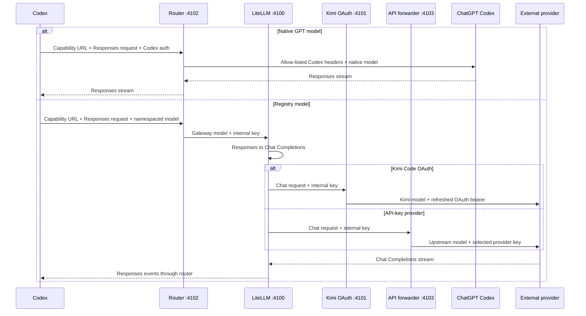

# How Codex Router works

## Why a router is needed

The Codex App expects the Responses API and a Codex-shaped model catalog.
Kimi and DeepSeek expose OpenAI-compatible Chat Completions APIs with different
authentication and request details. Codex Router bridges those contracts while
leaving native GPT traffic on the normal ChatGPT Codex backend.

Four pieces make the integration work:

- A generated catalog places external models beside native GPT models.
- A dispatcher chooses native or external routing by namespaced model ID.
- LiteLLM translates Responses requests, streams, and tool calls.
- Credential forwarders inject only the selected provider's authentication.

## Request flow

## One registry, multiple consumers

`config/providers.json` supplies the model mapping used by the catalog, router,
gateway generator, API forwarder, and doctor.

`enabled-providers.json` is a separate local policy. It controls both picker
visibility and dispatcher access. A known namespaced model whose provider is
hidden receives a local `provider_not_enabled` error; it is never mistaken for a
native model or forwarded with Codex authentication. The policy is read on each
external request, so provider visibility can change without restarting the
service (Codex itself still needs a restart to reload the picker catalog).

| Picker model | Public slug | Gateway model | Upstream model |
| --- | --- | --- | --- |
| Kimi K3 OAuth | `kimi-oauth/k3` | `kimi-oauth-k3` | `k3` |
| Kimi K3 API | `kimi-api/kimi-k3` | `kimi-api-k3` | `kimi-k3` |
| DeepSeek V4 Flash | `deepseek/deepseek-v4-flash` | `deepseek-v4-flash` | `deepseek-v4-flash` |
| DeepSeek V4 Pro | `deepseek/deepseek-v4-pro` | `deepseek-v4-pro` | `deepseek-v4-pro` |

The native catalog objects are preserved rather than reconstructed, which keeps
current instructions and capability metadata from the installed Codex build.
Registry models clone a current native schema and replace picker-specific
metadata.

The integration deliberately keeps the built-in `openai` provider and points
it at a loopback `openai_base_url`. This makes named models appear in the normal
picker instead of replacing the provider with a generic `Custom` entry.

The managed base URL contains a separate random caller capability. The router
validates it before reading a model request or contacting any upstream. Codex
cannot attach an arbitrary router-specific header to the built-in provider, so
the capability is carried in the URL path. Status, migration, and support tools
redact it, while Codex config and all snapshots are current-user-only files.
The router additionally requires JSON content, rejects browser-origin headers,
and never grants CORS access.

## Credential boundaries

| Route | Incoming Codex credential | Upstream credential |
| --- | --- | --- |
| Native GPT | Allow-listed and forwarded | Existing ChatGPT/Codex authentication |
| Kimi OAuth | Discarded | Kimi CLI OAuth bearer from `~/.kimi-code` |
| Kimi API | Discarded | Kimi Platform API key |
| DeepSeek | Discarded | DeepSeek API key |

The Codex-to-router and internal-service trust boundaries use two different
random keys, each stored with mode `600` or a current-user Windows ACL. Neither
is a provider credential. Each external forwarder removes Codex account,
installation, attestation, and private headers before sending a request upstream.

## Provider normalization

Kimi K3 API requests select `kimi-k3` and force maximum reasoning. Kimi Code
OAuth retains its own refresh and device-identity behavior.

DeepSeek V4 requests select the exact official upstream model, enable thinking,
and map Codex reasoning levels to DeepSeek's supported `high` and `max` values.
Sampling parameters that DeepSeek documents as ineffective in thinking mode are
removed. Both current V4 models use the same shared forwarder and credential.

The retired DeepSeek alias routes remain hidden registry entries. This keeps
old CLI commands working only as long as DeepSeek continues serving those
upstream aliases without advertising them to new users.

## Transport and compaction

Current Codex builds first attempt a Responses WebSocket. The router responds
with HTTP 426, and Codex falls back to HTTP. Request bodies may use Zstandard,
gzip, deflate, or Brotli; the router safely decompresses them before inspecting
the model ID.

Codex can compact history through `/responses/compact` or a
`compaction_trigger`. External Chat Completions providers cannot create OpenAI's
opaque encrypted compaction payload, so the router asks the selected external
model for a continuation summary and wraps it in a router-owned `kcr1:` payload.
On replay, it converts that payload back to a plain continuation message.

Commands, permissions, MCP tools, skills, and task state remain in Codex. Only
model inference and external-model compaction are routed.
