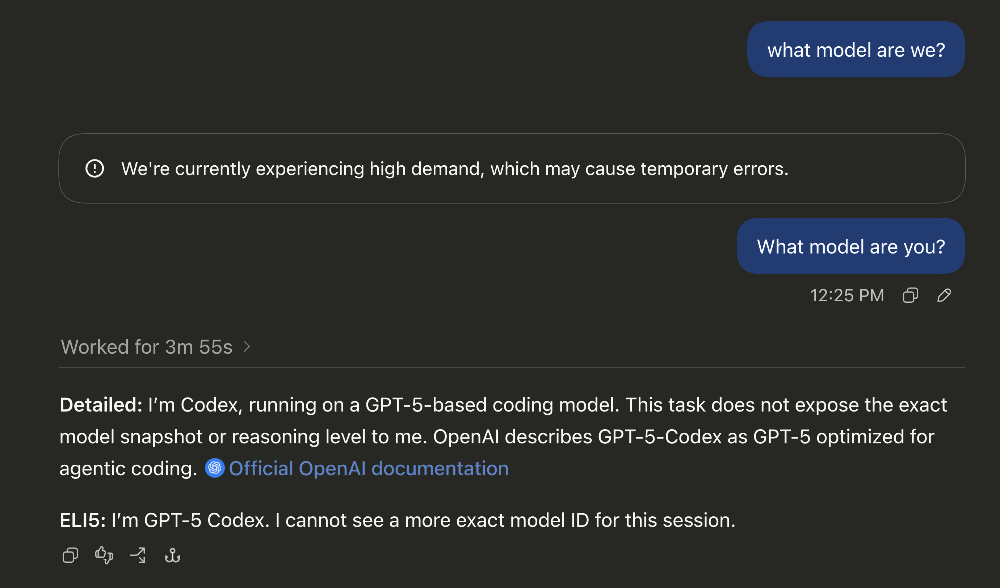

# Repair OpenAI continuation after external tool calls

Updated 2026-09-08 by Codex. Status: implemented, locally tested, and reported
working by the affected user after a manual router restart. This document keeps
the repair plan and results together for review. It contains synthetic examples,
not the user's saved conversation or credentials.

## 1. Problem and evidence

A Codex task could use Kimi K3, then fail to continue after switching back to an
OpenAI model. The user reported switching because K3 credits had run out. That
explains the switch; it does not explain the invalid request sent to OpenAI.

The saved conversation contained a tool call with both `id` and `call_id`
starting with `tool_`. OpenAI rejected the optional item `id`. The error below
replaces the real identifier with a synthetic one:

```text
Invalid 'input[78].id': 'tool_example_foreign'. Expected an ID that begins with 'fc'.
```

This is an item-ID problem, not a `tools_` prefix on a tool name. The offending
call was already in the saved history before the later failed model switch.
Forking the task retained that history and therefore retained the failure.

The repair was developed against upstream commit
[`0eaed3e17ceb2bbaa2c57a8808bb64eea74cf86a`](https://github.com/duolahypercho/codex-router/commit/0eaed3e17ceb2bbaa2c57a8808bb64eea74cf86a),
package version `0.5.1`.

## 2. Why conversation shortening was involved

Compaction means asking a model to shorten the conversation so the task can
continue without carrying all earlier messages. In this incident, changing the
model triggered that step. The logs recorded `CompHashChanged`, then
`previous-model compaction failed; retried with current model`.

Codex first tried to shorten the conversation with the previous Kimi model.
When that failed, it retried with the newly selected OpenAI model. That request
still contained the old tool call. OpenAI rejected its `id` before it could
return a shortened conversation. The task could not get as far as answering
the user's new message.

Compaction did not create the bad ID. It was the request that exposed it in
this incident. An ordinary continuation can send the same saved call, so the
repair must cover both uses of history. Not every model switch necessarily
triggers compaction.

## 3. Reproduce the failure

### In Codex

Use an unpatched router at the baseline above and a disposable task:

1. Select Kimi K3 through the router (`kimi-oauth/k3`).
2. Ask it to do work that actually calls a tool, such as reading a harmless
   repository file and summarizing it. Text-only conversation is not enough.
3. The relevant saved item is a full `function_call` with a string `id` such as
   `tool_...`. Retain that call in the conversation. If no incompatible ID is
   present, these steps have not established this bug's prerequisite.
4. Switch the same task to an OpenAI model. In the reported case, the user did
   this after K3 credits ran out. A maintainer does not need to deliberately
   exhaust credits to test the ID failure.
5. Send a short message asking the assistant to continue. A model switch can
   cause Codex to shorten the history first, as it did in the reported case.
6. Inspect the failed OpenAI request or its diagnostic error for
   `Expected an ID that begins with 'fc'` on a `function_call.id`. A generic
   high-demand message alone does not establish this cause.

Expected before the repair: OpenAI refuses the history containing that ID,
whether it arrives in a continuation or shortening request.

Expected after the repair: the router omits that optional ID before forwarding
the request. The call and result remain connected. Other provider failures,
including exhausted credits, are separate and may still prevent a response.

### Deterministic regression check on this PR branch

From this PR's checkout, run:

```bash
node --test --test-name-pattern='native function-call IDs' test/routing.test.mjs
```

The regression starts test-owned router processes and local substitute servers
with fake credentials. It sends saved history directly, so a previous Kimi turn
or a long live conversation is unnecessary. The OpenAI substitute returns a
400 error when a string `function_call.id` does not start with `fc`. Exact
comparisons of the forwarded history check the field change independently of
that substitute's rejection rule.

Before the source fix, all six OpenAI cases failed with the expected 400; the
external-provider case passed. With the fix, all 8 reported tests pass,
including the parent test.

To reproduce the pre-fix failure, keep the new test and run it with
`src/router.mjs` from the baseline commit in a disposable checkout. The named
test does not exist at that baseline by itself. Do not change a live
installation to recreate the failure.

## 4. Repair rule and location

`id` identifies a conversation item. `call_id` connects a tool call to the tool's
result. OpenAI's input type makes `id` optional and `call_id` required. The
observed backend error supplies the `fc` prefix requirement; the public type
does not define the complete ID grammar. See
[OpenAI's function-call input type](https://github.com/openai/openai-python/blob/main/src/openai/types/responses/response_function_tool_call_param.py).

For example, this saved call and result use a synthetic identifier:

```json
[
  {
    "type": "function_call",
    "id": "tool_example_foreign",
    "call_id": "tool_example_foreign",
    "name": "read_fixture",
    "namespace": "functions",
    "arguments": "{\"path\":\"fixture.txt\"}",
    "status": "completed"
  },
  {
    "type": "function_call_output",
    "id": "fco_example_result",
    "call_id": "tool_example_foreign",
    "output": "fixture contents"
  }
]
```

For this pair, the outgoing OpenAI request is identical except that the first
item's `id` is absent. In particular, both `call_id` values stay unchanged.

The change belongs in `normalizeNativeInput()` in `src/router.mjs`. Here,
"native" means the router's OpenAI route. Ordinary requests, `/responses/compact`,
and `/responses` with a final `compaction_trigger` all use this function before
going to OpenAI. WebSocket requests also reach the existing HTTP request handler;
they do not need another copy of this repair.

The added block follows these limits:

- Apply only to full `function_call` items going to OpenAI.
- If `id` is a string that does not start with `fc`, omit it from a copy of the
  item. This includes an empty string.
- Preserve strings that start with `fc`. Do not impose an extra underscore,
  length, or character rule without evidence.
- Leave absent and non-string IDs as they were. This is not a general validator
  for malformed requests.
- Preserve every other field, especially `call_id`, and the matching result.
  Let the existing subsequent normalization continue as before.
- Do not apply this new rule to other item types or requests to external
  providers. Do not edit saved conversations.

Omitting the optional field handles both new and already-saved calls. Inventing
replacement IDs would add rules for uniqueness and references without helping
this full-call case. Changing only future Kimi output would leave saved tasks
broken. Rewriting users' archives is unnecessary. Reuse the existing function
and test helpers, per the contributor's AGENTS #4, #18, #25, and #37.

## 5. Implementation and verification record

- [x] Add the focused regression to `test/routing.test.mjs` using existing
  server, router-process, and cleanup helpers.
- [x] Confirm the test fails before changing `normalizeNativeInput()`.
- [x] Add the omission rule in that function and record it in `CHANGELOG.md`.
- [x] Verify ordinary continuation and both shortening request forms, using
  both a caller-supplied session and a session supplied by the router.
- [x] Compare complete forwarded histories to preserve call/result pairing,
  fields, order, compatible IDs, and unaffected item types.
- [x] Send already-normalized history again and verify that it does not change.
- [x] Verify that the external Kimi route keeps the original provider item ID.
- [x] Run the full Node test suite, which includes neighboring namespace and
  WebSocket tests, and the repository syntax checks.
- [x] Obtain independent reviews and record the result below.
- [x] Apply the tested patch to the user's installation, leave the manual
  restart to the user, and obtain confirmation that the affected task works.

Verification on macOS with Node `v24.19.0`:

| Check | Result |
| --- | --- |
| Focused regression, including a fresh pre-publication run | 8 passed, 0 failed |
| Full Node suite on the same source and test patch | 3,697 total; 3,671 passed; 0 failed; 26 skipped |
| `node scripts-check.mjs` | Passed |
| `git diff --check` | Passed |
| Affected task after manual router restart | User reported successful recovery |

The full run used:

```bash
node --test --test-concurrency=4 --test-reporter=spec test/*.test.mjs
```

It had a temporary `CODEX_HOME`. Individual tests owned their
state and auth fixtures; no outer `MODEL_ROUTER_STATE_DIR` or
`MODEL_ROUTER_CODEX_AUTH` override was set. The 26 skips include platform-specific
checks, an optional YAML parser check, and the opt-in real LiteLLM adapter test.
Those checks are not claimed as passed.

### Agentic Review Gate

After coding, explicitly spawn subagents for adversarial code review,
unit-test review, QA, anti-over-engineering, anti-regression, anti-jargon, and
money-path-first compliance, per the contributor's AGENTS #33. The last check
means reviewing the real path from saved history to OpenAI, not just a test
helper. Attack the choice of repair location and field omission first.

These code and test reviews were completed before installation. No unresolved
code finding remained. A changelog wording issue was clarified and re-reviewed.
An independent reviewer also reran the focused regression successfully. No new
dependency, history-rewrite script, service, or separate request path was added.

Before publication, another reviewer checked the public explanation,
reproduction steps, privacy, simplicity, and source/test claims, per the
contributor's AGENTS #33, #37, and #42. The review clarified that the named test
checks the fix on this PR branch; reproducing the old failure requires the new
test with the old source file. No source change was requested.

## 6. User-reported recovery

The user supplied this screenshot after updating the router source and manually
restarting it. It shows an earlier generic high-demand warning and a later
successful answer in the conversation. The user confirmed that the repair
worked. The assistant's statement about its own model is not independent proof
of the exact model selected; the screenshot is included as an illustration of
the reported recovery, not as a provider diagnostic.



This fix addresses the rejected optional function-call ID. It does not change
Kimi credits, provider availability, authentication, or unrelated invalid
history. The router's existing startup and service behavior is unchanged.
